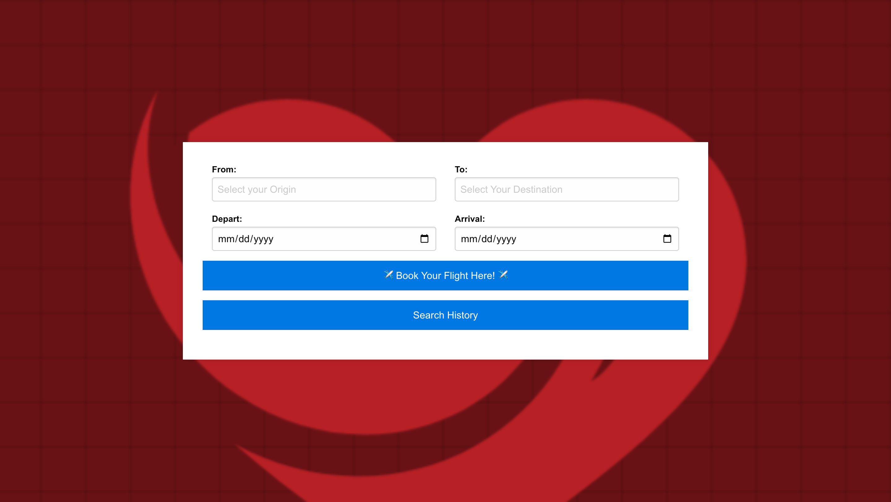
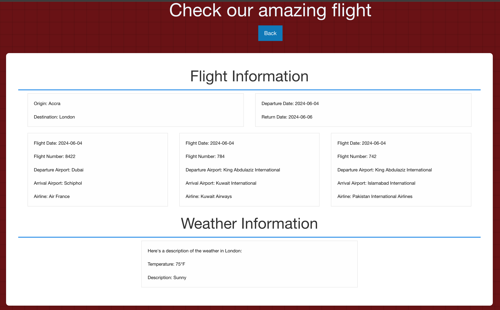

# XOXO Flight Availablity APP

## Description:

The Flight Availability and Weather Tracker is a tool designed to help users find available flights and obtain weather information for their destination. By entering the origin, destination, and date of travel, users can access a list of available flights for their specified route and date. Additionally, the tool provides the weather conditions at the destination, allowing users to better plan their trips.

## Purpose:
The purpose of this project is to provide travelers with a convenient way to check flight availability and weather conditions in one place. This helps users make informed decisions about their travel plans, ensuring they have the latest information on both flight options and destination weather.

### Installation Instructions

To install and run the Flight Availability and Weather Tracker project locally, follow these steps:

1. **Clone the Repository**
   First, clone the repository from GitHub:
   ```sh
   git clone https://github.com/yourusername/flight-availability-weather-tracker.git
   ```

2. **Navigate to the Project Directory**
   Change to the project directory:
   ```sh
   cd flight-availability-weather-tracker
   ```

3. **Edit the API Key**
   The project uses APIs from RapidAPI and Aviation Stack. Open the JavaScript file where the API keys are set, and replace the placeholder keys with your own API keys.

   Example:
   ```javascript
   const RAPID_API_KEY = 'your_rapid_api_key_here';
   const AVIATION_STACK_API_KEY = 'your_aviation_stack_api_key_here';
   ```

4. **Open the Project in a Browser**
   Since the project is a static website, you can open the main HTML file directly in your web browser. Navigate to the project directory and open the `index.html` file in your preferred browser.

**Prerequisites**
- A modern web browser (e.g., Chrome, Firefox, Safari).
- Valid API keys for RapidAPI and Aviation Stack.

### Usage Instructions

1. **Enter Flight Information**
   - Open the application in your browser.
   - Enter the origin, destination, and date of your flight.

2. **Get Available Flights and Weather Information**
   - Click the "Search" button.
   - The application will display a list of available flights and the weather conditions at your destination.

By following these instructions, users can set up and use the Flight Availability and Weather Tracker to find available flights and weather conditions for their travel plans.

### Features

The Flight Availability and Weather Tracker offers the following features:

1. **Search for Available Flights**: Users can input the origin, destination, and date to find all available flights for the specified route and date.

2. **Weather Information**: Provides current weather conditions for the destination, helping users plan accordingly.

3. **User-Friendly Interface**: A simple and intuitive interface that makes it easy for users to enter flight details and view results.

4. **Real-Time Data**: Retrieves real-time flight and weather data using reliable APIs, ensuring users get the most up-to-date information.

5. **Responsive Design**: The application is designed to work seamlessly on various devices, including desktops, tablets, and smartphones.

6. **Error Handling**: Displays appropriate error messages for invalid inputs or when data cannot be retrieved, enhancing user experience.


### Contributing Workflow

1. **Fork** the repository.
2. **Clone** the forked repository to your local machine.
3. **Create** a new branch for your feature or bug fix.
4. **Make** your changes and ensure they follow our coding standards.
5. **Write** tests to cover your changes if applicable.
6. **Run** tests to ensure your changes don't break existing functionality.
7. **Commit** your changes with a clear and descriptive message.
8. **Push** your changes to your forked repository.
9. **Submit** a pull request to the original repository, referencing any relevant issues.
10. **Participate** in the code review process by responding to feedback and making necessary adjustments.

## Technologies Used

- **HTML**: Used for structuring the web pages.
- **CSS**: Used for styling the web pages.
- **Foundation CSS Framework**: Used to streamline and enhance the CSS styling.
- **JavaScript**: Used for client-side scripting to enhance interactivity.
- **JQuery**: Used to 
- **Rapid Weather API**: Integrated to fetch weather data.
- **Aviation Stack API**: Integrated to retrieve aviation-related information.

## Created By

- Aminata Sall
- Meadin Menbere
- Sofia Kaminski
- Tatiana Velardo

## File Structure

   /ASSETS
        style.css      
        index.js        
        secound.js      
    secound.html   
    index.html
    README.md


## Screenshots





## Deployment Link

### Link to Repository
https://github.com/tatiana-vel/CBPROJECT1


